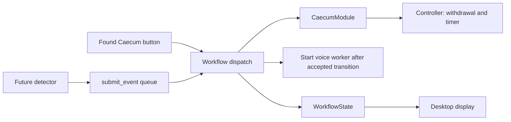

# DeepGI ASR

Voice-activated colonoscopy findings reporting, with a desktop procedure workflow targeting Windows and NVIDIA GPUs and an existing command-line pipeline.

During withdrawal, say **"Hey DeepGI"**, wait for the spoken prompt to finish, then dictate your finding. The system transcribes it, extracts seven structured fields, and saves the result. Inference runs locally; initial model downloads require network access.

## Desktop app (Windows / NVIDIA)

Use Python 3.11 or 3.12 with Tcl/Tk installed (included by the standard Windows Python installer). Install the repository dependencies in your environment, including a PyTorch build that supports your NVIDIA GPU. Whisper also requires FFmpeg available on PATH. Kokoro requires its voice/model assets and eSpeak NG installed and available on Windows.

```powershell
py -3.11 -m venv venv
.\venv\Scripts\Activate.ps1
python -m pip install -r requirements.txt
python -c "import torch; print(torch.cuda.is_available())"
python -c "import sounddevice as sd; print(sd.query_devices())"
```

Before launching, edit `config.py`:

- Point `LLM_BASE_MODEL_PATH` and `LLM_LORA_PATH` at your local Qwen2.5-3B-Instruct and trained LoRA folders. The adapter must include `adapter_config.json` and its weights. Incomplete base weights may be downloaded automatically.
- Set `AUDIO_DEVICE` to the input-device ID printed above, or `None` for the system default. Wake-word detection and finding recording use this same device. Speech playback uses the system output device.
- Keep `ASR_DEVICE = "cuda"`, `LLM_DEVICE = "cuda:0"`, and `USE_KOKORO_TTS = True` for the current Windows configuration. The `say` fallback is macOS-specific.
- Current defaults are Whisper tiny for the wake word, Whisper medium for findings, English transcription, and an eight-second finding recording. CNN detection remains optional through `USE_FINETUNED_VAD` and its checkpoint.

```powershell
python desktop_app.py
```

The window opens while models load in the background. Start Procedure becomes available when loading succeeds and both IDs have been entered. Missing models/dependencies appear in the window with a **Retry Loading** button.

| Phase | Input | Behavior |
|---|---|---|
| Ready | Enter case ID and patient ID; **Start Procedure** | Freeze IDs and record case start; enter Insertion |
| Insertion | **Found Caecum / Start Withdrawal** | Record the landmark, start the withdrawal timer, and enable wake-word listening |
| Withdrawal | **Hey DeepGI**, then dictate after the prompt | Capture one finding, extract JSON, save it, and read a summary; resume listening |
| Withdrawal | **Reached Anus / End Procedure** | Record anus arrival and case end; immediately freeze the timer and stop accepting triggers |
| Completed | **Export JSON** or **New Case** | Export all data, or clear the saved case and return to Ready |

Withdrawal time includes recording, model processing, and speech playback. If End Procedure is pressed during an accepted finding, the timer freezes immediately and that finding finishes before final export/New Case become available. Findings are enabled only during Withdrawal. There is no separate Record button.

The interface shows the phase, timer, voice activity, findings list, event log, and final JSON. Select a finding to inspect its transcription and all seven fields: `lesion_type`, `location`, `size_mm`, `procedure`, `biopsy_forceps`, `biopsy_pieces`, and `pathology`.

### Case output and recovery

Each case is automatically saved to `outputs/reports/case_<internal_id>.json`. Entered IDs are stored as data, not used in filenames; separate cases can use the same entered IDs without overwriting earlier files. Saves replace snapshots atomically after state changes and finding outcomes.

The JSON contains `schema_version`, `internal_id`, `case_id`, `patient_id`, `procedure_type`, `phase`, timezone-aware start/landmark/end timestamps, `withdrawal_duration_seconds`, `events`, `findings`, `processing_errors`, and a final `summary`. Each finding includes capture/completion timestamps, transcription, and its seven-field `result`. `pending_finding`, `incomplete`, `interrupted_at`, and `finalized` distinguish unfinished snapshots from final results. The timer uses a monotonic clock; changing the system time does not change elapsed duration.

Events include `CASE_START`, `LANDMARK_DETECTED` (`CECUM` or `ANUS`), `WITHDRAWAL_START`, `FINDING_DETECTED`, and `CASE_END`. Findings accepted before case end may finish afterward, so their result event can follow `CASE_END`; capture and completion timestamps distinguish these moments. Errors and explicit app interruption are recorded as `PROCESSING_ERROR` and `CASE_INTERRUPTED`.

Empty recordings add no finding. Extraction errors retain any available transcription in `processing_errors`; malformed model JSON is reported as an error. A speech-playback error leaves an already saved finding intact. **Retry Listening** restarts the voice loop after an audio/processing failure without resetting the case or timer.

Save failures retain results in memory and enable **Retry Save**. New Case and export remain unavailable until data is saved. Closing an active case asks for confirmation, freezes its timer, stops listening, lets an accepted finding finish, and saves an incomplete snapshot without adding a normal case-end event. The window remains responsive while an in-flight model operation finishes. Interrupted files can be inspected manually; reopening/resuming them is not implemented.

This version handles one case at a time. Video detection, external REST/WebSocket integrations, BBPS, intervention/device tracking, physician editing/confirmation, and narrative report generation are not implemented.

### Module boundaries and caecum signals

The desktop is a view and input adapter. It creates widgets, displays state,
collects case/patient IDs, and opens confirmation/Save As dialogs. Business rules
and worker coordination live under `modules/`; `desktop_app.py` does not call the
controller or voice worker directly.

| Component | Responsibility |
|---|---|
| `modules/caecum.py` | `CaecumDetected` signal and `CaecumModule`; bind a detection to the current internal case ID and ask the controller to start withdrawal |
| `modules/procedure/workflow.py` | `ProcedureWorkflow`; model readiness, event dispatch, voice-worker messages, retries, ending/resetting a case, export, and graceful shutdown |
| `modules/procedure/controller.py` | Authoritative phase transitions, monotonic timer, findings, case persistence, and finalization |
| `modules/procedure/voice_worker.py` | Existing background audio/model execution and request/reply queues |
| `desktop_app.py` | Render `WorkflowState`, forward inputs, and poll the workflow every 100 ms |



The button is still the actual caecum input. No vision detector, device protocol,
or network endpoint is added. Future producers can send the same signal without
implementing timing or phase logic themselves:

```python
from modules.caecum import CaecumDetected

# On the application thread, capture the internal ID when assigning a case to
# the detector. `workflow` is the app's existing ProcedureWorkflow instance.
case_internal_id = workflow.state().case_internal_id

# Called later by the detector, including from a background thread:
def on_caecum_detected():
    workflow.submit_event(CaecumDetected(
        case_internal_id=case_internal_id,
        source="vision",
    ))
```

Capture the ID for the case being observed; do not replace it with whichever
case happens to be current when a delayed detection arrives. It is the generated
`internal_id`, not the manually entered case ID. Stale, repeated, out-of-phase,
and interrupted-case detections cannot reset the timer or restart listening.
`source` describes the producer in the signal; the existing saved JSON schema
and event names remain unchanged.

Create `ProcedureWorkflow` on the application thread and call `start()` once.
`dispatch(event)` applies a caecum signal immediately on that thread;
`submit_event(event)` only enqueues it and is safe from other threads.
`process_pending()` handles queued signals and voice-worker messages on the
application thread. Calling `dispatch()` from a different thread raises an
error instead of mutating case state there.

Other application commands are `start_case(case_id, patient_id)`, `end_case()`,
`retry_voice()`, `retry_save()`, `new_case()`, `export_json(path)`, and
`close(confirmed=False)`. `end_case()` freezes the timer synchronously; it does
not wait for the next queue poll. `state(case_id, patient_id)` returns detached
case data, status text, allowed actions, identity-field editability, and close
confirmation/completion flags. The UI renders these values instead of repeating
phase rules. A close request still requires polling until `ready_to_close` is
true, allowing accepted findings and worker cleanup to finish.

The report import now resolves to `generate_report.py` and loads at report
generation time. PDF formatting and PDF error behavior are otherwise unchanged.
In particular, the existing report generator still rejects zero-finding cases;
this can leave a finalized case with a save error even though its JSON was written.
This refactor does not repair the report template's existing field-mapping issues.

### Verification

Run automated caecum, controller, voice control-flow, and headless workflow tests without downloading models or using a microphone:

```powershell
python -m unittest discover -s tests -v
```

An optional real-window smoke test uses fake voice input, exercises the buttons/results/export, and closes automatically:

```powershell
python tests/desktop_smoke.py
```

Controller/workflow tests and the desktop smoke test mock the PDF renderer.
They verify state, JSON persistence, timing, signal delivery, and UI behavior;
they do not certify actual PDF output or bypass report failures in the real app.

On the Windows GPU machine, verify the real audio path:

1. Launch `desktop_app.py`, wait for model readiness, and enter both IDs. Confirm buttons enforce Ready → Insertion → Withdrawal.
2. Start withdrawal and check that its timer increments. Say Hey DeepGI, wait for the full prompt, and dictate an English finding within eight seconds. Check transcription, seven fields, and spoken feedback; repeat for a second finding.
3. End the procedure while a finding is recording or extracting. Confirm the timer freezes at the button press, the pending finding finishes, and no further wake words are accepted.
4. Inspect/export the final JSON: IDs, events, timezone-aware timestamps, frozen duration, and all findings should match the window.
5. Start a new case and finish with zero findings; confirm earlier files are intact. Test microphone disconnection/retry and closing during an active case; confirm the incomplete snapshot has no fabricated case-end event.

---

## How It Works

```
Microphone → VAD + wake-word detector → ASR → Qwen/LoRA extraction → Save → TTS
```

| Component | What it does |
|-----------|-------------|
| **VAD** | WebRTC speech segmentation followed by Whisper tiny (default) or an optional CNN wake word model |
| **ASR** | Records 8 seconds and transcribes with Whisper or optional Qwen3-ASR |
| **LLM** | Extracts seven structured finding fields with Qwen2.5 + LoRA |
| **TTS** | Reads a summary using Kokoro (default) or macOS `say` |

---

## Command-line setup (macOS)

The existing `python pipeline.py` and `python demo.py` entry points retain the continuous finding loop without desktop phase controls. Configure local model paths and CPU/device settings before using them on macOS; the checked-in settings target Windows/CUDA.

```bash
# 1. Clone the repo and enter the directory
git clone <repo-url>
cd DeepGI-Testing

# 2. Create and activate virtual environment
python3.11 -m venv venv
source venv/bin/activate

# 3. Install dependencies
pip install -r requirements.txt
```

---

## Quick Start (using pre-trained model)

If a trained `classifier_cnn.pt` is already provided:

```bash
source venv/bin/activate
python pipeline.py
```

Say **"Hey DeepGI"**, speak your finding, and it will be transcribed and logged to `outputs/reports/`.

---

## Training the CNN Wake Word Model (your own voice)

The CNN VAD must be trained on voices that will use the system. If it does not detect your voice, follow these steps.

### Step 1 — Check your microphone device ID

```bash
python -c "import sounddevice as sd; print(sd.query_devices())"
```

Find your microphone in the list and set its ID in `config.py`:

```python
AUDIO_DEVICE = 1   # replace with your device ID
```

### Step 2 — Record your voice samples

```bash
python training/record_for_vad.py
```

- Follow the on-screen prompts
- Record **trigger phrases** ("Hey DeepGI" and variants) — aim for 50+ samples
- Record **non-trigger speech** (random sentences) — aim for 100+ samples
- Files are saved to `training_data/audio_vad/` and logged in `training_data/audio_vad/metadata.csv`

> Record in a quiet environment, at a normal speaking distance from the microphone.  
> More speakers = more robust model. Have everyone who will use the system record samples.

### Step 3 — Train the CNN

```bash
python training/train_vad_cnn.py
```

- Trains for 40 epochs (~2–5 minutes on CPU)
- Saves the best checkpoint to `outputs/models/vad-deepgi/classifier_cnn.pt`
- Watch the F1 score — anything above 0.85 is good for demo use

### Step 4 — Enable the CNN in config

In `config.py`:

```python
USE_FINETUNED_VAD = True   # already True by default
```

### Step 5 — Run the pipeline

```bash
python pipeline.py
```

You should see:
```
[VAD] CNN model loaded. threshold=0.65, sr=16000, clip=3.0s
[VAD] Listening for wake word...
```

Say "Hey DeepGI" — the confidence score prints on each attempt.

---

## Configuration (`config.py`)

| Setting | Default | Description |
|---------|---------|-------------|
| `AUDIO_DEVICE` | `1` | Microphone device ID (`None` = system default) |
| `USE_FINETUNED_VAD` | `False` | Enable the optional CNN wake word model |
| `USE_FINETUNED_ASR` | `False` | Use fine-tuned Whisper (requires training) |
| `USE_KOKORO_TTS` | `True` | Use Kokoro neural TTS |
| `WHISPER_MODEL` | `"medium"` | Finding transcription model size |
| `TRIGGER_WHISPER_MODEL` | `"tiny"` | Wake-word transcription model size |
| `ASR_BACKEND` | `"whisper"` | Select `"whisper"` or optional `"qwen"` backend |
| `QWEN_ASR_MODEL` | `"Qwen/Qwen3-ASR-0.6B"` | Qwen model for the optional backend |
| `TRIGGER_CHUNK_DURATION` | `3` | Seconds of audio passed to CNN |
| `FINDING_DURATION` | `8` | Seconds recorded after trigger |

---

## Optional: Kokoro Neural TTS

Kokoro is enabled by default. Initial setup may require downloading its model assets:

```bash
# Download the model (~400MB, one time only)
export HF_TOKEN=your_huggingface_token
huggingface-cli download hexgrad/Kokoro-82M --token $HF_TOKEN
```

Then in `config.py`:

```python
USE_KOKORO_TTS = True
```

---

## Optional: Fine-tune Whisper ASR

To improve transcription accuracy on medical terminology:

```bash
# 1. Record medical finding samples
python training/record_samples.py

# 2. Fine-tune Whisper
python training/train_asr.py

# 3. Enable in config
# USE_FINETUNED_ASR = True
```

## Optional: Compare Whisper with Qwen3-ASR

Qwen's official ASR family is **Qwen3-ASR**, available in 0.6B and 1.7B
checkpoints. The project defaults to 0.6B because it is the more practical
local comparison model. Whisper remains the default and is not replaced.

```bash
# Install Qwen's official local inference package (one time)
pip install -U qwen-asr

# Evaluate both models against the same files in training_data/metadata.csv
python training/evaluate.py
```

The report at `outputs/evaluate_results.txt` lists WER and average inference
latency for Whisper and Qwen side by side. Qwen weights download automatically
on first use.

To try Qwen in the live pipeline instead, change only this setting in
`config.py`:

```python
ASR_BACKEND = "qwen"
```

For a higher-accuracy (and substantially heavier) comparison, change
`QWEN_ASR_MODEL` to `"Qwen/Qwen3-ASR-1.7B"`. On a CPU-only Mac, keep
`QWEN_ASR_DEVICE = "cpu"` and `QWEN_ASR_DTYPE = "float32"`.

---

## Evaluating the VAD Model

After training, run evaluation to see accuracy, precision, recall, and confusion matrix:

```bash
python training/validate_vad.py
```

---

## Project Structure

```
DeepGI-Testing/
├── config.py                          # all settings in one place
├── pipeline.py                        # main entry point
├── requirements.txt
│
├── modules/
│   ├── voice_activation/
│   │   └── detector.py                # CNN wake word detection
│   ├── asr/
│   │   └── transcriber.py             # Whisper transcription
│   └── tts/
│       └── speaker.py                 # say / Kokoro TTS
│
├── training/
│   ├── record_for_vad.py              # record wake word samples
│   ├── train_vad_cnn.py               # train CNN wake word model
│   ├── validate_vad.py                # evaluate VAD model
│   ├── train_vad.py                   # (legacy) sklearn logistic regression
│   ├── record_samples.py              # record ASR training samples
│   └── train_asr.py                   # fine-tune Whisper
│
├── training_data/
│   ├── audio_vad/                     # wake word .wav files
│   │   └── metadata.csv
│   └── metadata.csv                   # ASR training metadata
│
└── outputs/
    ├── models/
    │   └── vad-deepgi/
    │       └── classifier_cnn.pt      # trained CNN model
    └── reports/                       # session transcription logs
```
